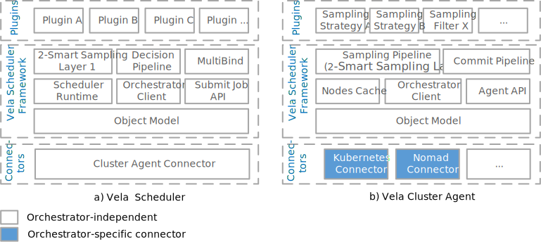
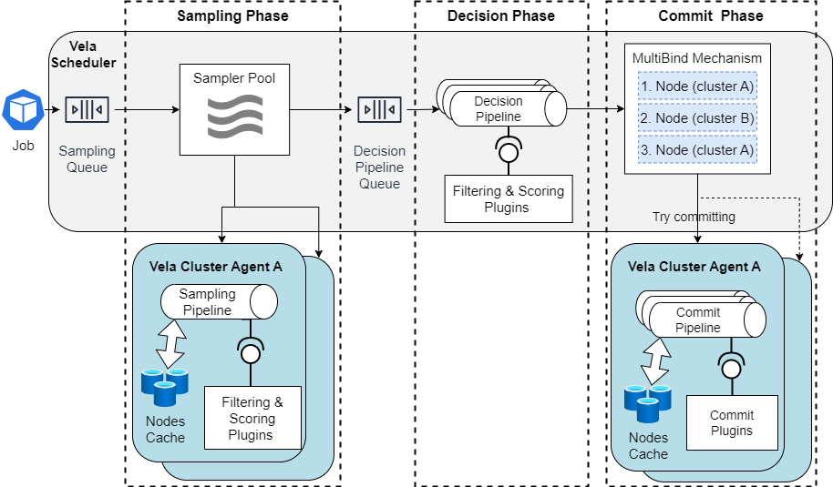
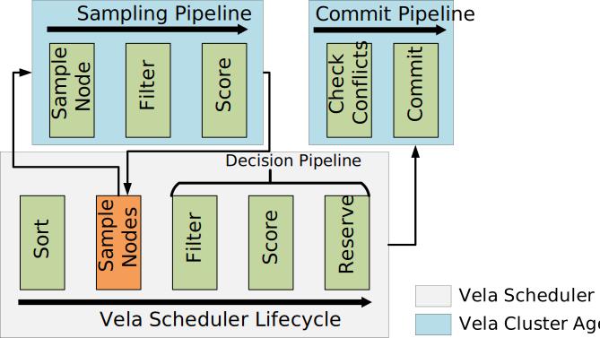

# Vela Scheduler Documentation

This documentation describes the Vela Scheduler architecture and the scheduler's deployment.

## Architecture

The high-level architectures of Vela Scheduler and the Vela Cluster Agent are shown in the diagram below.
Both consist of the following three major layers:

1. The *Vela Scheduler Framework* in the middle provides the object model and runtime services. It realizes the generic scheduling and sampling pipelines. To promote flexibility, sampling, filtering, and scoring policies need to be implemented as plugins.
2. The *orchestrator-specific Connectors* at the bottom are used by the generic components in the upper layers.
3. The *plugins* in the top layer realize scheduling and sampling policies.

The central part of the architectures is the Vela Scheduler Framework.
All of its components are completely orchestrator-independent and only the Orchestrator Client needs to be realized by an orchestrator-specific connector.
In Vela Scheduler this is done through the Cluster Agent Connector, which is actually also orchestrator-independent; only in the Cluster Agent we have orchestrator-specific connectors.
The Object Model provides abstractions, e.g., for nodes and pods.
The Submit Job API exposes an orchestrator-independent endpoint to submit new jobs to a scheduler instance -- we borrow the `Pod` abstraction (and some others) from the Kubernetes core libraries (without losing orchestrator independence) to model a job.
In the documentation we use the words "jobs" and "pod" interchangeably.
The Agent API of the Cluster Agent is used by the scheduler to communicate with the Cluster Agent and presents the only interface for the scheduler to a cluster.
It provides endpoints for sampling nodes and submitting scheduling decisions and may be expanded in the future to provide further endpoints for retrieving additional cluster information.
The Vela Scheduler Runtime powers the scheduling process, sets up the API and pumps pods into the scheduling pipeline.
The Sampling Service serves an analogous purpose with respect to the sampling pipeline. The Nodes Cache is used by the Cluster Agent to cache information about the nodes in its cluster.
It is updated at a high frequency, preferably through an event-based change notification mechanism if the underlying orchestrator supports it, to ensure that its information reflects the current state of the cluster.

**Note on naming**: Vela Scheduler was originally called Polaris Scheduler.
However, we decided to fork the distributed scheduler into its own repository and renamed it to Vela Scheduler (however, the code keeps using the name `polaris-scheduler`).
Thus, the Polaris project contains two scheduler projects:

- [Polaris Scheduler](https://github.com/polaris-slo-cloud/polaris-scheduler): An SLO-aware Kubernetes scheduler.
- [Vela Scheduler](https://polaris-slo-cloud.github.io/vela-scheduler/): An orchestrator-independent distributed scheduler for the Edge-to-Cloud continuum, with support for multiple clusters.

In code we use `Pod` abstraction, which we borrow from the Kubernetes core libraries (without losing orchestrator independence), to model a job.
In the documentation we use the terms job and pod interchangeably.

## 3-Phase Scheduling Workflow

Vela's scheduling workflow consists of three phases: **sampling**, **decision**, and **commit**, as shown in the figure above.
Each phase supports plugins for implementing most parts of the scheduling logic (see [Sampling-, Decision-, and Commit Pipelines](#sampling--decision--and-commit-pipelines) for the available extension points).

A job/pod may be submitted to an arbitrary instance of the Vela Scheduler.
Within this instance, the pod is added to the sampling queue.
Once the pod is dequeued, it enters the sampling phase, where multiple pods can be processed in parallel by a pool of samplers.
The sampler that took the pod is responsible for executing the **2-Smart Sampling** mechanism, which consists of two steps:

1. The sampler contacts a the Cluster Agents of a configurable percentage of the available clusters (`percentageOfClustersToSample` in the config, sometimes referred to as `Cp` - "clusters percentage") and asks them for node samples, passing along the requirements of the pod to ensure that the Cluster Agents know what needs to be scheduled.
2. Each Cluster Agent executes its Sampling Pipeline, which obtains a configurable percentage of nodes (`nodesToSampleBp`, also referred to as `Np`) from its Nodes Cache either using random or round-robin sampling and then runs the configured filtering and scoring plugins on these nodes to assess their suitability for the pod. Filter plugins remove nodes that are incapable of hosting a pod and Score plugins assign scores from 0 to 100 to each eligible node (i.e., nodes that have survived filtering), giving higher scores to nodes that are more suitable for the pod.

Once the list of samples has been collected from the chosen clusters, the pod and the merged list of samples are added to the decision pipeline queue.
The decision pipeline executes another set of filtering and scoring plugins that allow enforcing global policies that would not be feasible to implement at the Cluster Agent level.
At the end of this phase, all eligible nodes are sorted according to their accumulated scores and the top 3 nodes are selected to enter the commit phase.
The number of candidate nodes is configurable in the settings (`commitCandidateNodes`).

In the commit phase, the **MultiBind** mechanism starts by trying to commit the pod to the node with the highest score.
To this end it contacts the respective Cluster Agent, which first pre-reserves the pod's resources in its Node Cache to make them unavailable for sampling requests, and then executes the commit pipeline plugins, which ensure that the node is still eligible to host the pod.
This step is necessary, because in a distributed scheduler another scheduler instance might have assigned another pod to this node since it was sampled for the current pod, and, thus, the resources might not longer be available - this would cause a scheduling conflict.
If the node is still capable of hosting the pod, the pod is committed to the node and a success code is returned to the scheduler.
If a scheduling conflict is detected, the pre-reservation of resources in the cache is undone and a conflict code is returned to the scheduler.
Upon a scheduling conflict, the MultiBind mechanism proceeds to the second highest scored node, and if this causes a conflict as well, to the third highest scored node.
Only if all three nodes return a scheduling conflict during MultiBind, the pod's scheduling workflow ends with a scheduling conflict, thus, causing the pod to be rescheduled, i.e., sent back to the sampling queue.

Details on the implementation can be found in the [3-Phase Scheduling Workflow Implementation](./scheduling-workflow-detail.md) document.

## Sampling-, Decision-, and Commit Pipelines

The Scheduling Pipeline forms the centerpiece of the Polaris Distributed Scheduler and defines the scheduling and decision-making process.
The pipeline consists of a sequence of stages, as shown in the above diagram, whose business logic is realized by plugins, which enables the realization of different scheduling polices.
The Sort and Sample Nodes stages support only a single plugin each, while the other stages support multiple plugins.

Details on the implementation can be found in the [3-Phase Scheduling Workflow Implementation](./scheduling-workflow-detail.md) document.

## Deployment

The [deployment](../deployment) directory of this repository contains configuration files to configure and deploy Vela Scheduler and the Vela Cluster Agent.
Copy the contents of this directory to a working directory and adapt the configuration files as needed.

### Vela Cluster Agent

For the Cluster Agent we currently provide an implementation with the Kubernetes connector and [deployment files](../deployment/cluster-agent/kubernetes) for it.
To deploy the agent in a cluster, adapt the `1-config-map.yaml` file and then run `kubectl apply -f ./` in the same folder.

### Vela Scheduler

Since Vela Scheduler is completely orchestrator-independent, we provide a docker-compose file for easy deployment of a single instance [here](../deployment/scheduler).
Adapt the YAML configuration file in this directory to your needs - the default configuration will work fine in most cases, but you must configure the list of clusters in the `remoteClusters` object.
