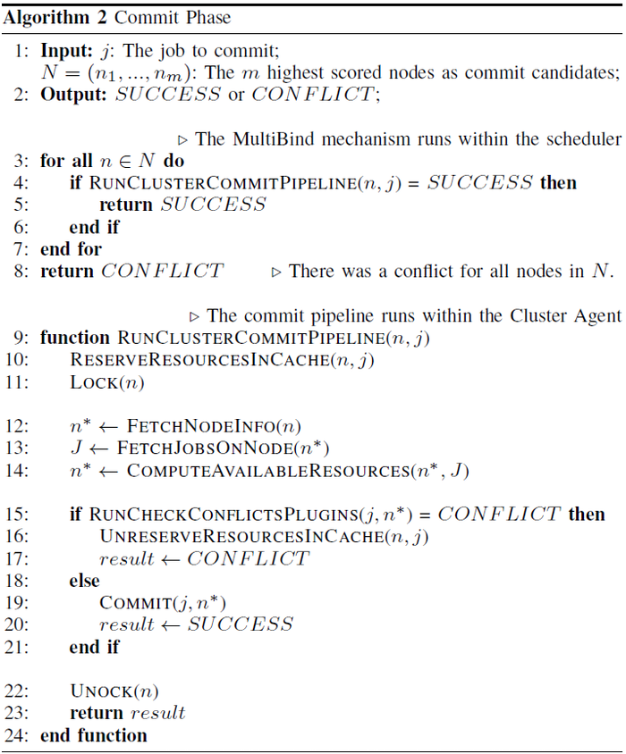

# 3-Phase Scheduling Workflow Implementation

This document describes the 3-Phase Scheduling Workflow of Vela Scheduler in more detail to provide an overview of the involved interfaces and classes (we use the term "class" to refer to Go structs).
Godoc documentation for the source code is available [here](https://polaris-slo-cloud.github.io/vela-scheduler/godoc/pkg).
Note that the code uses the name `PolarisScheduler` instead of Vela.
The packages in the class diagrams below do not resemble actual package names, but are used to indicate whether a type resides within the scheduler or the cluster agent.

## Sampling Phase

The class diagram above shows the main interfaces and classes involved in the sampling phase.
The `DefaultPolarisScheduler` is the main class implementing the scheduler process.
It is initialized with a `PodSource` object;
The `PodSubmissionApi`, which provides the REST interface for receiving new pods implements this interface.
Upon receiving a new pod, from its `PodSource`, the `DefaultPolarisScheduler` adds it to the `PrioritySchedulingQueue`, which represents the sampling queue.
It uses a `SortPlugin` to establish an order among the incoming pods - only one `SortPlugin` can be configured.

The scheduler maintains a list of `SampleNodesPlugin` objects, which resemble the sampler pool.
All these objects are of the same type, because only one such plugin can be configured.
A new pod is dequeued from the sampling queue, whenever there is an idle sampler available.
By default, **2-Smart Sampling** is used, which delegates sampling to a random subset of Cluster Agents, which pick nodes that fulfill the requirements of the pod.
The high-level algorithm is shown in the figure below.
To this end, the `RemoteNodesSamplerPlugin` is used at this stage, which relies on the `DefaultRemoteSamplerClientsManager` to contact the `Cp` percent of the remote cluster agents to ask them for node samples.

In the cluster agent, the `DefaultPolarisNodesSampler` exposes a REST interface to accept sampling requests.
Each request contains the pod and its requirements, the sampling strategy to use (e.g., `random` or `round-robin`), as well as, the percent of nodes that should be sampled (`Np`).
The nodes sampler maintains a set of `SamplingPipeline` instances, each of them containing the configured set of plugins.
Each sampling strategy is implemented by a `SamplingStrategyPlugin` - there is only a single instance of each plugin that is shared across all sampling pipelines.
This decision was made intentionally to ensure that these plugins can maintain a global state within the cluster agent, e.g., the `RoundRobinSamplingPlugin` has to advance its current index with every request irrespective of the sampling pipeline that issues it, otherwise two subsequent requests from different pipelines would get the same nodes.
The sampling strategy is used to obtain node samples, which are then evaluated by the filter and score plugins.
This procedure is carried out in a loop until `Np` eligible nodes have been found or a timeout is reached.
The final list of sampled nodes is returned to the scheduler, where it is added to the decision pipeline queue together with the pod.

## Decision Phase

Once a pod is dequeued from the decision pipeline queue, it enters the decision phase, whose main interfaces and classes are shown in the class diagram above.
The `DefaultPolarisScheduler` maintains a set of `DecisionPipeline` instances; whenever a pipeline is free, the next pod is dequeued from the decision pipeline queue.
Each decision pipeline processes one pod at a time and has its own set of plugin instances, which ensures that no synchronization is needed between the pipelines or scheduler instances during the decision phase.

The plugins follow the same filtering and scoring principle as those in the sampling pipeline, with a Reserve stage added at the end, which allows updating third-party data structures after the target nodes have been chosen.
While filter and score plugins in the decision pipeline are conceptually the same as those in the sampling pipeline, we maintain these stages in both pipelines, because in the decision pipeline different plugins can be used to enforce global policies that would not be feasible to implement at the Cluster Agent level.

After scoring is completed, the eligible nodes are sorted and the top `m` nodes are picked as commit candidates for the MultiBind mechanism in the commit phase.
The number `m` is configurable through the `commitCandidateNodes` setting.
These commit candidates are advanced to the commit phase.

## Commit Phase

The commit phase is governed by the MultiBind mechanism, which takes the `m` commit candidate nodes from the decision phase and tries to commit the pod to the highest ranked node, iteratively proceeding through the list of commit candidates if a scheduling conflict occurs.
The high-level algorithm is presented in the figure below.

The MultiBind mechanism within `DefaultPolarisScheduler` tries to commit the pod to the highest ranked node.
If this node returns a scheduling conflict, the pod is not immediately rescheduled, but instead, MultiBind proceeds to the second highest ranked node and so on, until it either finds a node that does not have a scheduling conflict or until the list of commit candidates is exhausted.
If all commit candidates return a conflict, the pod is declared to have a scheduling conflict and is returned to the sampling queue to be rescheduled.

To commit a pod to a node, the `DefaultPolarisScheduler` retrieves the `ClusterClient` for the Cluster Agent that manages the node and uses this client to call the Cluster Agent's REST interface.
The REST interface is operated by the `DefaultPolarisClusterAgent` object, which immediately reserves the pod's resources in the `NodesCache`.
This step is critical to ensure that the resources that are about to be committed to a pod are no longer available to the sampling pipelines.
This reservation step is done regardless of whether the resources are still available on the node or not, i.e., a node's available resource count may reach negative numbers in the cache, which does not affect the correctness of the system, because a negative available CPU or memory count will never fulfill any pod's requirements during sampling.
After the resources have been reserved, the pod is passed to the next available `BindingPipeline` instance.

The `DefaultPolarisScheduler` maintains a set of `BindingPipeline` instances (the interface was created before the official names "commit phase" and "commit pipeline" surfaced, but the purpose is the same) - the next free pipeline instance is assigned the pod for committing.
The `BindingPipeline` first uses the global `EntityLocker` to lock the candidate node, which has no effect on sampling, but prevents other `BindingPipeline` instances from accessing it.
The `EntityLocker` can be seen as a giant lock map - it manages lock objects, which are referenced using keys, without storing the actual nodes.
It is a mechanism that we use to make a large number of globally shared objects lockable, even if they do not support locking themselves.
It also discards any locks that are currently unused, which allows saving memory when working with a large pool of objects, like the nodes of a cluster.
After locking, the node is checked by the `CheckConflictsPlugins`, which are similar to filter plugins - their job is to ensure that the node still has the resources required to host the pod.
This step is needed, because we are operating in a distributed system, where multiple schedulers or scheduling pipelines simultaneously make decisions and, thus, resources that were available when the pod was in the sampling phase might have already been assigned to another pod.
If no conflicts are found, the pod is committed to the node, as is the preliminary resource reservation in the `NodesCache`, and a success response is returned to the scheduler.
If, however, there is a conflict, the preliminary resource reservation in the `NodesCache` is rolled back and the scheduler is notified of the conflict.

As noted previously, a pod is declared as having a scheduling conflict only if all commit candidate nodes yield a conflict.
In such cases the pod is rescheduled, which means that it needs to traverse the entire scheduling workflow again.
A pod that fails scheduling for a total of 10 times, is considered as having failed.

Our [experiments](https://polaris-slo-cloud.github.io/vela-scheduler/experiments/2023-03/) have shown that MultiBind can reduce the number of scheduling conflicts by up to a factor of 10.
