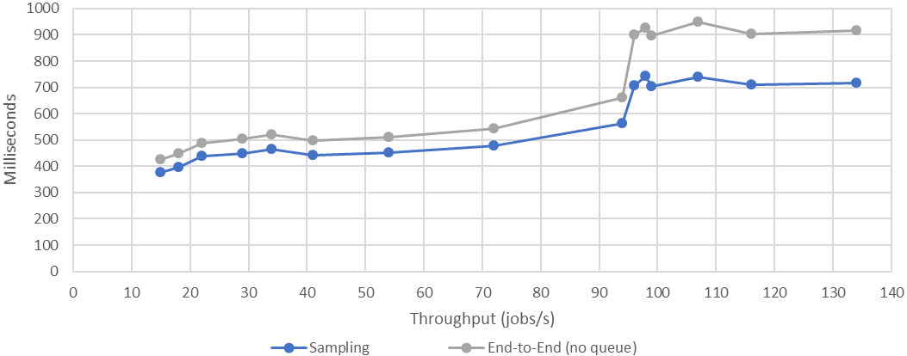

# Experiment Results

This page documents the results of an extensive set of experiments conducted using Vela Scheduler in March 2023.
This page is partially an extended version of the evaluation presented in the paper "Vela: A 3-Phase Distributed Scheduler for the Edge-Cloud Continuum" submitted to the [2023 IEEE International Conference on Cloud Engineering (IC2E)](https://conferences.computer.org/IC2E/2023/index.html).

The executed [experiments](./README.md) involved a supercluster consisting of 10 subclusters of varying sizes, hosted on 10 VMs.
Three sets of experiments were run:

1. **Configuration Tuning** using the [2-smart-sampling-tuning](./README.md#2-smart-sampling-tuning) suite to find optimal values for the `percentageOfClustersToSample` and `nodesToSampleBp` settings, i.e., the percentage of clusters to sample for each pod and the percentage of nodes to sample within each of these clusters.
Each experiment iteration runs on a 20k nodes supercluster and creates 11,200 pods with 4 CPUs and 4 GiB RAM (the maximum number of such pods supported in this cluster).
The aim is to find the lowest configuration values that yield zero scheduling failures.

2. **Scalability with Respect to Infrastructure** using the [scalability-nodes](./README.md#scalability-nodes) suite to assess the scalability of Vela Scheduler on increasing cluster sizes, specifically 1K, 5K, 10K, 15K, and 20K total nodes.

3. **Scalability with Respect to Workload** using the [scalability-jobs](./README.md#scalability-jobs) suite to stress test the scheduler using a gradually increasing workload on a 20k nodes supercluster.

## Setup

To set up the clusters in our testbed we use 10 Google Cloud Platform (GCP) VMs of type `c2-standard-8`, each having 8 vCPUs and 32 GB of memory and running on a physical machine with an Intel Cascade Lake or later processor.
Every VM is bootstrapped with Ubuntu 22.04, on top of which we install MicroK8s v1.25.6 to initialize a distinct single node Kubernetes cluster.
We rely on [fake-kubelet](ttps://github.com/wzshiming/fake-kubelet) to create simulated nodes in each MicroK8s cluster.

Since Vela Scheduler focuses on the Edge-Cloud continuum, the 10 clusters are intentionally not homogeneous.
We simulate three Cloud and seven Edge clusters with different types of nodes; the hosting VMs are located in different regions.
The node details and regions are listed in the table below.
The scheduler itself is also deployed on a `c2-standard-8` VM and is located in the Zurich region.
Our load generator, Apache JMeter, is run on a VM with 24 vCPUs and 47 GiB of RAM.
The hosting server in Vienna, Austria has an Intel Xeon CPU (Cascade Lake) with a base clock of 2.1 GHz.

<table>
    <thead>
        <tr>
            <th></th>
            <th>Node Type</th>
            <th>vCPUs</th>
            <th>RAM</th>
            <th>Regions</th>
        </tr>
    </thead>
    <tbody>
        <tr>
            <td rowspan=3>Cloud</td>
            <td>cloud-small</td>
            <td>2</td>
            <td>4</td>
            <td rowspan=3>Belgium, Oregon, Finland</td>
        </tr>
        <tr>
            <td>cloud-medium</td>
            <td>4</td>
            <td>8</td>
        </tr>
        <tr>
            <td>cloud-large</td>
            <td>8</td>
            <td>16</td>
        </tr>
        <tr>
            <td rowspan=3>Edge</td>
            <td>Raspberry Pi 4B</td>
            <td>4</td>
            <td>2 or 4</td>
            <td rowspan=3>Belgium, Netherlands, Frankfurt, Montreal, Oregon, Finland, Iowa</td>
        </tr>
        <tr>
            <td>Raspberry Pi 3B+</td>
            <td>4</td>
            <td>1</td>
        </tr>
        <tr>
            <td>cloudlet</td>
            <td>4</td>
            <td>8</td>
        </tr>
    </tbody>
</table>

## Results

### Configuration Tuning

For this experiment we focus on finding the lowest values for `percentageOfClustersToSample` and `nodesToSampleBp` that yield zero scheduling failures.
We aim for the lowest configuration values, because sampling fewer (globally distributed) clusters and fewer nodes within each cluster naturally leads to faster execution times than sampling more clusters and/or nodes.
Since rescheduling attempts are common in distributed schedulers, we consider a job to have failed scheduling, only after having attempted rescheduling a total of ten times without success.

<figure>
    
    <figcaption align="center">Fig. 1: Vela Scheduler Workflow Overview</figcaption>
</figure>

Fig. 1 shows the number of scheduling failures as a percentage of the total jobs.
It is evident that the number of failures decreases as the number of sampled clusters increases, because the scheduler has more nodes to choose from.
The failures first reach zero at `percentageOfClustersToSample` = 50% and `nodesToSampleBp` = 4%, which is what we will use for the remaining experiments.
At `percentageOfClustersToSample` = 60% and `nodesToSampleBp` = 4%, there is a single failure, but starting at `percentageOfClustersToSample` = 70%, there are no more failures, which is why we have excluded larger `percentageOfClustersToSample` values from the Figure for clarity.
The full set of results, including the number of rescheduling attempts, is available in our repository.

### Scalability with Respect to Infrastructure

This experiment focuses on evaluating the performance of Vela Scheduler on increasing cluster sizes to show its scalability.
We examine execution times of the sampling phase, the commit phase, and the E2E times, i.e., the time from adding a job to the sampling queue until a successful end of the commit phase.
Since we noticed a significant latency increase of the MicroK8s API server under high load (e.g., creating a pod object sometimes took about 8 seconds), we do not include the interaction with Kubernetes in the commit and E2E metrics, instead we fetch node information only from our cache and consider the commit pipeline successful once we make the commit in our cache, before we issue a write request to the orchestrator.
This allows us to focus solely on the Vela Scheduler performance.

<figure>
    
    <figcaption align="center">Fig. 2: Mean Scheduling Times (ms) at `percentageOfClustersToSample` = 50% and `nodesToSampleBp` = 4% for Total Nodes.</figcaption>
</figure>

Fig. 2 summarizes the mean execution times in this experiment, showing a linear increase for all of them.
We observe two different E2E times: one including time spent in the sampling queue (E2E) and one without (E2E-nq).
When including queuing time, E2E time increases much faster, albeit still linearly.
This is because as the sampling duration increases, the threads responsible for step one of 2-Smart Sampling in the scheduler are blocked for a longer time.
Since we have 80 sampling threads (CPU cores x 10) in the experiment, these threads are at some point all waiting for responses and thus many of the 1, 000 jobs that arrive in very quick succession need to stay in the queue longer.
This could be alleviated, e.g., by running multiple concurrent scheduler instances.

<figure>
    
    <figcaption align="center">Fig. 3: Sampling Times (ms) at `percentageOfClustersToSample` = 50% and `nodesToSampleBp` = 4% for Total Nodes.</figcaption>
</figure>

<figure>
    
    <figcaption align="center">Fig. 4: Commit Times (ms) for Total Nodes.</figcaption>
</figure>

<figure>
    
    <figcaption align="center">Fig. 5: End-to-End Times (ms), without Sampling Queue at `percentageOfClustersToSample` = 50% and `nodesToSampleBp` = 4% for Total Nodes.</figcaption>
</figure>

The sampling, commit, and E2E-nq times are shown in Fig. 3, 4, and 5 respectively.
For 1K total nodes, sampling takes a mean of 243.3 ms, which is a reasonable time for getting samples from five globally distributed clusters, considering global packet round trip times (e.g., the [Verizon SLA](https://www.verizon.com/business/terms/latency/) for a Europe-USA packet round trip, including intra-Europe and intra-US round trips is 165 ms).
Sampling times increase linearly with the cluster sizes to a mean of 902.1 ms for 20K total nodes.
E2E-nq times also increase linearly from 297.9 ms for 1K nodes to 1087.1 ms for 20K nodes.
This shows that most of the time is spent in 2-Smart Sampling, which is reasonable given that all Filter and Score plugins currently run as part of the sampling pipeline.
The commit phase involves only communication with the target cluster, conflicts checking for a single node, cache operations, and possible MultiBind retries.
Thus, its contribution to the E2E time is fairly low, ranging from 53.1 ms for 1K nodes to 182.8 ms.

### Scalability with Respect to Workload

In this experiment we evaluate all results with focus on the scheduler’s throughput in jobs per second (jobs/s) and the total number of scheduling decisions per second (SDPS).
We calculate the throughput by dividing the number of successfully scheduled jobs by the total time the Vela Scheduler was active.
This time is calculated using the difference between the scheduling finish timestamps of the last successful job and the first successful job.
We compute this value for every iteration of our experiment and round it to the next integer value, giving us a throughput ranging from 15 jobs/s up to 134 jobs/s.
The SDPS are the total number number of scheduling attempts irrespective of their results (i.e., success, conflict, try rescheduling due to no nodes found, or failure due to too many rescheduling attempts) divided by the total execution time.
The SDPS range from 15 to 817.
We stopped our experiments at this number, because the simulated cluster resources were getting exhausted, thus, leaving too little space for scheduling other jobs.

| Req/sec | Queuing Time (msec) | Rescheduling Attempts | Scheduling Decisions per Second (SDPS) | Throughput w MultiBind (jobs/s) | Throughput no MultiBind (jobs/s) |
|---------|---------------------|-----------------------|----------------------------------------|---------------------------------|----------------------------------|
| 15      | 0                   | 0%                    | 15                                     |  15                             | 15                               |
| 18      | 0                   | 0%                    | 18                                     |  18                             | 18                               |
| 22      | 0                   | 0%                    | 22                                     |  22                             | 21                               |
| 29      | 0                   | 0%                    | 29                                     |  29                             | 27                               |
| 34      | 0                   | 0%                    | 34                                     |  34                             | 32                               |
| 40      | 0                   | 0%                    | 41                                     |  41                             | 38                               |
| 54      | 0                   | 0%                    | 54                                     |  54                             | 49                               |
| 72      | 1                   | 0%                    | 72                                     |  72                             | 62                               |
| 94      | 6                   | 0%                    | 95                                     |  94                             | 75                               |
| 99      | 106                 | 0%                    | 100                                    |  98                             | 73                               |
| 133     | 30,097              | 0.04%                 | 110                                    |  107                            | 77                               |
| 175     | 35,499              | 53.50%                | 238                                    |  96                             | 87                               |
| 212     | 35,672              | 67.14%                | 384                                    |  99                             | 94                               |
| 254     | 32,562              | 73.20%                | 608                                    |  116                            | 112                              |
| 290     | 30,847              | 75.75%                | 817                                    |  134                            | 131                              |

The table above summarizes the results of this experiment.
It shows the request rate generated by JMeter in requests per second (req/s), the mean queuing time of a job before it is dequeued by the sampling pipeline, the SDPS, the percentage of rescheduling attempts (due to not finding suitable nodes), and the throughput in successfully scheduled jobs per second with and without MultiBind.
The mean queuing time and the SDPS are good indicators of whether the scheduler is able to keep up with the incoming workload.
Up until 99 req/s the queuing time is negligible, whereas starting with 133 req/s it suddenly rises to 30 seconds.
Likewise, the SDPS are equal to or greater than the request rate up until 99 req/s and start lagging behind at 133 req/s.
The throughput with MultiBind remains approximately equal to the input request rate (the difference of 1 in the row with 99 req/s is caused by rounding, the actual difference is less than 0.042), until 133 req/s, where it starts to fall behind.
These values indicate that the single instance configuration of Vela in the experiments can reliably sustain the scheduling of an input workload of approximately 100 req/s.
While this is sufficient for our AR use case, Vela is capable of much higher SDPS, as we discuss in the next paragraph.
The sudden increase in queuing time is due to the sampling threads waiting for responses from the Cluster Agents.
A maximum CPU usage of 93% in the scheduler VM indicates that the current thread configuration is ideal and that the scheduler needs to be scaled out to further increase performance.
Conversely, the Cluster Agents show a peak CPU usage of approximately 26%, indicating that thread-level parallelism could be further increased before scaling out, which we defer to future work.

<figure>
    
    <figcaption align="center">Fig. 6: Throughput (Successful Scheduling Decisions per Second) and Total SDPS.</figcaption>
</figure>

Fig. 6 compares the throughput, i.e., successful scheduling decisions per second, to the total number of scheduling decisions per second (SDPS).
The SDPS show a significant increase after 133 req/s, because of the number of rescheduling attempts, due to not finding suitable nodes.
Rescheduling attempts rise from zero until 99 req/s and 0.04% at 133 req/s to 53.4% at 175 req/s and 75.75% at 290 req/s, resulting in up to 817 total SDPS in the last case.
This is not caused by the scheduler, but by resources becoming scarce in the cluster, which leads to not finding any suitable nodes during sampling.
This can also be seen when examining the number of nodes that are sampled for each job.
Fig. 7 shows the number of sampled pods for the experiment iterations between 54 and 290 req/s.
While the median is close to 400 nodes (the desired sample size resulting from the scheduler configuration and cluster sizes) with lower req/s, it drops significantly as the scheduling workload increases - with increasing scheduling workload, there are more jobs that occupy cluster resources, hence more nodes get fully occupied.
However, this increased need for rescheduling attempts shows that a single Vela Scheduler instance is capable of supporting high numbers of SDPS, while managing clusters of 20k total nodes.

<figure>
    
    <figcaption align="center">Fig. 7: Sampled Nodes.</figcaption>
</figure>

<figure>
    
    <figcaption align="center">Fig. 8: Mean Sampling and E2E-no-queue Times (ms) with Respect to Throughput.</figcaption>
</figure>

Fig. 8 shows the mean sampling and the E2E-nq times of successful jobs with respect to the throughput in this experiment.
We can see that between a throughput of 15 and 94 jobs/s there is a linear increase.
Between 94 and 96 jobs/s there is a sudden spike, followed by very little change until the last experiment with a throughput of 134 jobs/s.
The sudden increase occurs at a point, where the throughput and the total SDPS are still equal.
While, the increase after this point until the last experiment iteration is minimal, our next step is to investigate the exact reason for the sudden jump and to fine-tune the sampling process in the Cluster Agents.

<figure>
    
    <figcaption align="center">Fig. 9: Scheduling Conflicts with and without MultiBind.</figcaption>
</figure>

Scheduling conflicts are common in distributed schedulers.
Their occurrence rate should be as low as possible to avoid rescheduling jobs, which consumes processing time.
In Fig. 9 we examine the percentage of scheduling conflicts of Vela Scheduler with and without the MultiBind mechanism.
The number of scheduling conflicts with MultiBind is reported directly by our scheduler, while the number of conflicts without MultiBind is obtained by counting all successful commit phases, where MultiBind retried committing at least once.
For the first five experiment iterations there are between zero and two scheduling conflicts with MultiBind.
Then, the rate starts increasing gradually, but stays below 1% of the total jobs until a throughput of 94 jobs/s, reaching its highest value of 2.76% at 107 jobs/s.
These numbers are very low compared to scheduling without MultiBind.
In this case there are 2.09% scheduling conflicts already in the first experiment iteration, gradually increasing up to a maximum of with 28.2% at 107 jobs/s.
This clearly shows the benefit of MultiBind; without it, the scheduling time would double or triple for up to 25% of the jobs, because they would need to traverse the Vela Scheduler lifecycle two or three times, due to rescheduling.
Altogether the numbers show very promising results, with Vela Scheduler having linear scalability and the MultiBind mechanism being a great improvement over a simple rescheduling on conflict approach.
